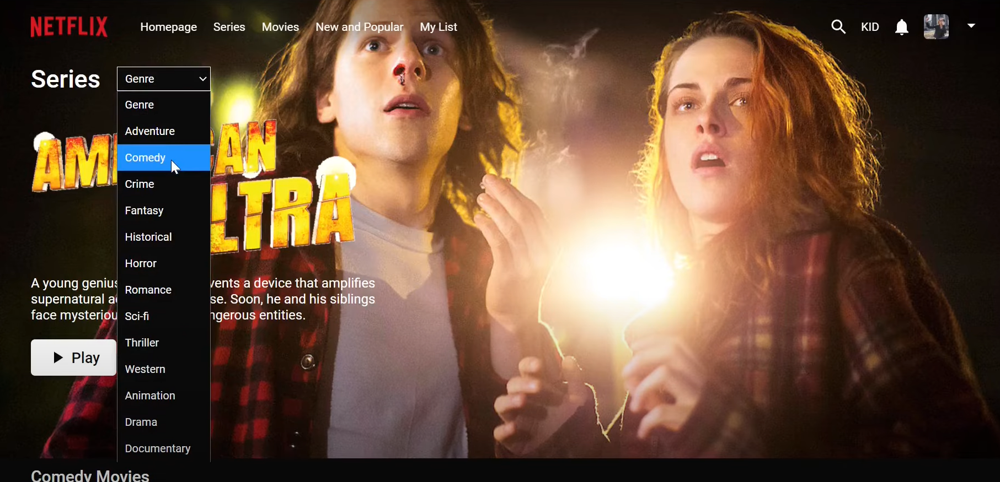
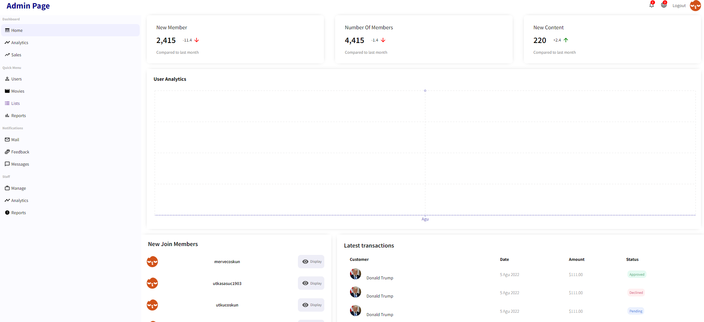
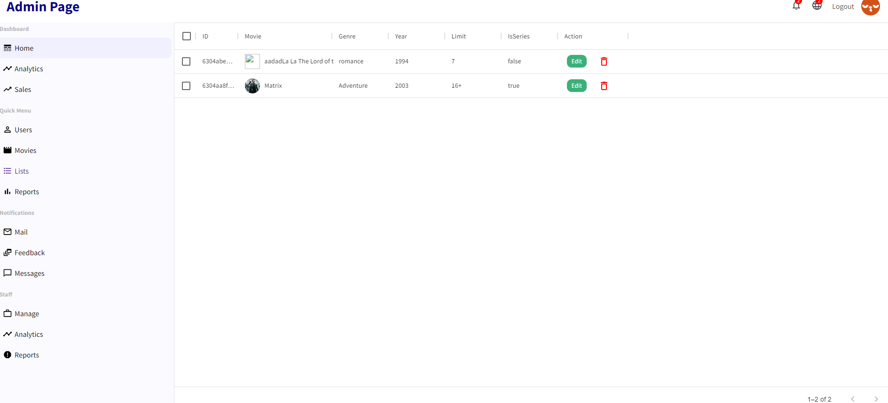

<!-- PROJECT LOGO -->
 

  

<h3 align="center">Netflix-app</h3>

 

<!-- ABOUT THE PROJECT -->
## About The Project
<h4><strong>Client Page</strong></h4>

<h4><strong>Admin Page</strong></h4>

(<a href="#readme-top">back to top</a>)

### Built With

* [![React][React.js]][React-url]
* [![React-Router][React-Router]][React-Router-url]
* [![Node][Node.js]][Node-url]
* [![Node.js Express][Node.js Express]][Node.js Express-url]
* [![Mongo.db][Mongo.db]][Mongo.db-url]
* [![Firebase.gb][Firebase.gb]][Firebase.gb-url]
* [![JWT][JWT]][JWT-url]
* ![HTML5][HTML5]

(<a href="#readme-top">back to top</a>)

<!-- ROADMAP -->
## Roadmap

- [x] Node.js
    - [x] Node.js Express API
    - [x] Node.js MongoDB Connection
    - [x] Node.js Register
    - [x] Login with JWT Authentication
- [x] Rest API
    - [x] Rest API Models
    - [x] Rest API Routes
    - [x] Rest API User CRUD Operations
    - [x] Rest API Movie CRUD Operations
    - [x] Rest API Movie Lists
- [x] React
    - [x] React Router Dom
    - [x] React Fetch Data from API
    - [x] Displaying Movies from API
    - [x] React Netflix Watch Page
    - [x] Fetching Featured Movie
    - [x] React Admin Panel
    - [x] React Admin Dashboard Chart
    - [x] Fetching Latest Users
    - [x] React Context API
    - [x] React Login with JWT
    - [x] React Admin Dashboard CRUD Operations
    - [x] Adding New Movie
    - [x] React Firebase Uploading File
    - [x] Movie List CRUD Operations
    - [x] React Authentication with JWT
- [x] Making App Responsive
- [x] Fixing Bugs

(<a href="#readme-top">back to top</a>)

<!-- CONTACT -->
## Contact

Utku Coşkun -  - utkucoskun1@gmail.com

(<a href="#readme-top">back to top</a>)

<!-- MARKDOWN LINKS & IMAGES -->
<!-- https://www.markdownguide.org/basic-syntax/#reference-style-links -->

[React.js]: https://img.shields.io/badge/React-20232A?style=for-the-badge&logo=react&logoColor=61DAFB&style=plastic&Width=30
[React-url]: https://reactjs.org/
[React-Router]: https://img.shields.io/badge/-React%20Router-CA4245?logo=react-router&logoColor=white&style=plastic&Width=30
[React-Router-url]: https://reactrouter.com/
[Node.js]:https://img.shields.io/badge/node.js-6DA55F?style=for-the-badge&logo=node.js&logoColor=white&style=plastic&Width=30
[Node-url]:https://nodejs.org/
[Node.js Express]:https://img.shields.io/badge/express.js-%23404d59.svg?style=for-the-badge&logo=express&logoColor=%2361DAFB&style=plastic&Width=30
[Node.js Express-url]:https://expressjs.com/
[Mongo.db]:https://img.shields.io/badge/MongoDB-%234ea94b.svg?style=for-the-badge&logo=mongodb&logoColor=white&style=plastic&Width=30
[Mongo.db-url]:https://www.mongodb.com/
[Firebase.gb]:https://img.shields.io/badge/firebase-%23039BE5.svg?style=for-the-badge&logo=firebase&style=plastic&Width=30
[Firebase.gb-url]:https://firebase.google.com/
[JWT]:https://img.shields.io/badge/JWT-black?style=for-the-badge&logo=JSON%20web%20tokens&style=plastic&Width=30
[JWT-url]:https://jwt.io/
[HTML5]:https://img.shields.io/badge/html5-%23E34F26.svg?style=for-the-badge&logo=html5&logoColor=white&style=plastic&Width=30

